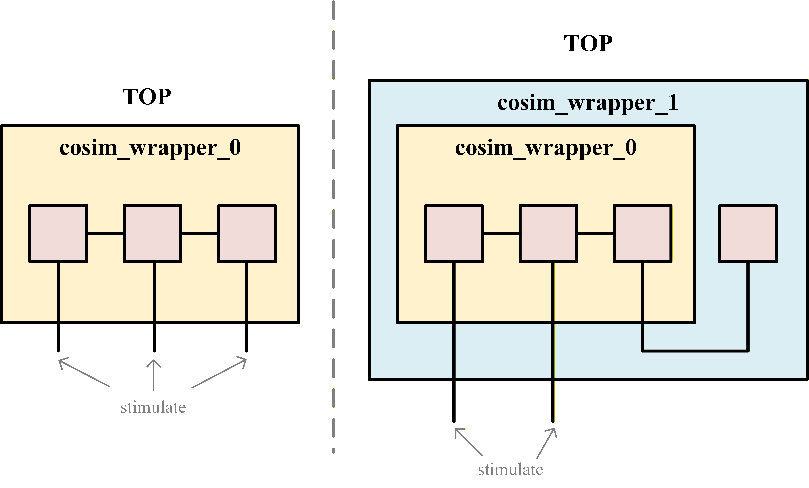

# CoCoTB 软硬件协同验证框架 (CoSim Framework)

## 📌 项目概述
本项目是一个基于 Python 和 CoCoTB 构建的软硬件协同验证框架。该框架采用了类似 UVM 的面向对象分层架构，旨在为复杂数字集成电路（尤其是涉及固件控制与共享存储的加速器或计算单元）提供一个高效、可复用的验证环境。框架原生支持**单元测试 (UT)** 与**系统测试 (ST)** 两种模式，允许验证工程师平滑地从模块级验证过渡到系统级软硬件协同仿真。

---

## 🏗️ 1. 软硬件测试框架介绍 (基础核心类)

框架的核心抽象定义在 `base.py` 中，通过规范化的基类约束了各个验证组件的行为与接口，确保了测试平台的可扩展性与高复用度。

| 基类名称           | 核心职责       | 说明                                                                                                                                         |
| :----------------- | :------------- | :------------------------------------------------------------------------------------------------------------------------------------------- |
| `BaseTransaction`  | 数据事务抽象   | 贯穿整个验证环境的底层数据结构。各个组件（Monitor、Model、Scoreboard）之间传递的 payload，自带 `id` 字段用于追踪。 |
| `BaseModel`        | 软件参考模型   | 纯软件的 Golden Model。通过监听输入队列获取激励，执行计算（`compute` 方法），并将预期结果 (Expected Transaction) 输出至 Scoreboard。                  |
| `BaseDriver`       | 硬件驱动器     | 负责在 UT 模式下将事务转换为具体的引脚时序信号，驱动 DUT (Device Under Test)。                                                                        |
| `BaseMonitor`      | 硬件监听器     | 包含输入与输出监听器。持续在时钟沿采样 DUT 信号，组装成 Transaction 并送入队列供 Model 或 Scoreboard 使用。          |
| `BaseScoreboard`   | 自动比对计分板 | 接收实际输出 (Actual) 与预期输出 (Expected) 队列，执行严格比对，统计 Match/Error 数量。                                |
| `BaseSequence`     | 事务序列生成器 | 可迭代的事务序列抽象基类。子类实现 `__next__` 方法以定义事务生成逻辑，配合 `BaseSequencer` 向executor(带有execute方法的鸭子类型)注入激励。                                        |
| `BaseSequencer`    | 事务序列调度器 | 管理事务队列，从多个 `BaseSequence` 中拉取事务并派发给 executor(带有execute方法的鸭子类型)执行。支持多序列并行注入，可自定义仲裁逻辑。                                               |
| `CoSimBase`        | 模块级协同封装 | 验证组件的顶层容器。负责将 Model、Driver、Monitors 和 Scoreboard 实例化并绑定到特定的 DUT 模块，提供统一的 `execute()` 接口。支持 HW/SW 双模式和 UT/ST 双级别。 |
| `CoSimWrapperBase` | 系统级环境封装 | 宏观验证环境封装类。负责管理多个 `CoSimBase` / `CoSimWrapperBase` 实例以及系统级的共享资源（如 RAM、FIFO 软模型），并根据固件指令进行任务分发与路由。支持嵌套。 |
| `SimLogger`        | 日志管理器     | 单例模式的仿真日志配置类。集中管理 root logger 与 cocotb logger 的级别、格式、过滤器及文件输出。                                                       |

---

## 🚀 2. Demo 介绍 (被测 RTL 逻辑概览)

本 Demo 演示了如何使用该框架验证一个包含存储交互的数据流水线系统。系统由两个主要计算子模块以及相应的存储器组成：

* **`add_one` 模块 (加一计算单元)**：
    * **行为**：收到启动指令后，根据给定的基地址 (`addr`) 和长度 (`len`) 从 RAM 中读取数据，将所有读取的数据加 1，并写入后级的 FIFO 中。
    * **验证实现**：对应 `examples/cosim_test/tb/add_one_cosim.py`。包含自定义的事务 `add_one_input_trans` 和 `add_one_output_trans`，以及精准模拟其行为的纯软件模型。
* **`sub_one` 模块 (减一计算单元)**：
    * **行为**：收到启动指令后，根据给定的长度 (`len`) 从前级 FIFO 中读取数据，将数据减 1，并推入系统的输出侧。
    * **验证实现**：对应 `examples/cosim_test/tb/sub_one_cosim.py`。同样实现了专用的软硬件事务与驱动模型。
* **存储系统 (`memory.py`)**：
    * 包含高度参数化的 `RAM` 和 `FIFO` Python 软模型。在测试平台中作为“共享资源”被 `examples/cosim_test/tb/cosim_test_wrapper.py` 实例化，用于捕获 DUT 内的存储状态，并在纯软件执行模式 (SW mode) 下提供数据源。

```
         +-----------------------------------------------------------------------+
         |                             RTL TOP (DUT)                             |
         |                                                                       |
[Clocks] |                                                                       |
 clk   >-|-------------------------------------------------------+               |
 rst_n >-|-------------------------------------------------------+               |
         |                                                       |               |
[Ctrl 1] |                        +-----------+                  v               |
 en_add  >----------------------->|           |       +----------------------+   |
 addr_add>----------------------->|  add_one  |======>| RAM                  |   |
 len_add >----------------------->|           |<======| (ram_addr, ram_rdata)|   |
         |                        +-----------+       +----------------------+   |
         |                              ||                                       |
         |                              || fifo_write_0                          |
         |                              || (write_en, write_data)                |
         |                              \/                                       |
         |                        +-----------+                                  |
         |                        |           |                                  |
         |                        |   FIFO    |                                  |
         |                        |           |                                  |
         |                        +-----------+                                  |
         |                          ||     /\                                    |
         |        fifo_read         ||     || fifo_write_1                       |
         |   (read_en, read_data)   ||     || (write_en, write_data)             |
         |                          \/     ||                                    |
[Ctrl 2] |                        +-----------+                                  |
 en_sub  >----------------------->|           |                                  |
 len_sub >----------------------->|  sub_one  |                                  |
         |                        +-----------+                                  |
         |                                                                       |
         +-----------------------------------------------------------------------+
```
---

## 💻 3. 使用案例介绍 (测试执行)

框架支持通过“固件指令 (Firmware Instructions)”的形式驱动测试，这极大地方便了软硬件协同场景下的用例编写。

### 测试用例编写 (Firmware-Driven)
在 `examples/cosim_test/tb/test_cosim_test.py` 中，提供了2种测试用例：
* 方式一：测试用例被定义为一个包含操作码、地址和长度等信息的字典列表：

```python
firmware = [
    {"op": "add_one", "addr": 0, "len": 5}, # 指令1：从RAM地址0读取5个数据加1后写入FIFO
    {"op": "sub_one", "len": 3},            # 指令2：从FIFO读取3个数据减1
    {"op": "sub_one", "len": 2}             # 指令3：从FIFO读取剩余2个数据减1
]
```

测试入口通过 `sys_ctrl` 模块按序解析并派发这些指令给底层的包装器执行。

* 方式二：测试用例通过`cosim_test_squence`生成，这是一个记录当前fifo状态的迭代器，可以随机生成指定数量的激励或者从文件中读取指令产生激励

### UT/ST 双模式切换
该框架通过环境变量 `ST` 实现了单元测试与系统测试的一键切换：

* **单元测试 (UT 模式)**：默认模式 (`ST=0` 或未定义)。
    在此模式下，系统会精准地按模块驱动引脚。Model 会同步计算预期结果，Driver 会下发时序，Scoreboard 会实时比对。如果在执行过程中出现数据错乱（Mismatch），Scoreboard 内置的后门机制 (`backdoor_handler`) 会自动将期望数据强行注入到后续的软件 FIFO 模型中，以防止错误级联放大，方便精准定位当前 Bug。
* **系统测试 (ST 模式)**：(`ST=1`)
    在此模式下，框架更侧重于顶层系统级验证。驱动器不再进行细粒度的局部干预，而是通过配置系统的顶层寄存器和启动使能信号（例如 `dut.en_add`, `dut.en_sub`）让整个 RTL 系统依靠真实物理时序流转，验证各模块之间的握手与数据搬运。

### 运行方式
在终端中，可以通过 Makefile 结合 CoCoTB 的环境变量传入指令来启动测试：

```bash
# 运行单元测试 (UT Mode)
make ctb-cosim_test

# 运行系统测试 (ST Mode)
make ctb-cosim_test ST=1
```

## 🎰 4. 验证框架机制

### 验证框架层次化机制

本验证框架结构的设计参考了UVM，设计了如下基类
* 基本组件: **driver**, **monitor**, **reference model**, **scoreboard**基类
* **cosim**基类(参考UVM env)用于封装driver, input monitor, reference model, output monitor, scoreboard组件，在初始化cosim类时会自动初始化其中的组件。
* **cosim_wrapper**基类用于封装**cosim**类或**cosim_wrapper**类实现, 初始化cosim_wrapper类时会自动初始化其中的所有cosim类和cosim_wrapper类

本验证框架的初始化参考了UVM build phase，只需要在顶层配置module list，即可按照list完成初始化

```python
sub_wrapper_modules = [
    ("add_one_cosim", add_one_cosim, {
        "dut": dut.u_add_one, "mode": "hw", "level": "st"}),
    ("sub_one_cosim", sub_one_cosim, {
        "dut": dut.u_sub_one, "mode": "hw", "level": "st"})
]

wrapper_modules = [
    ("sub_wrapper", sub_wrapper, sub_wrapper_modules),
    ("other_modules", other_module, {"mode":hw})
]
```

对UT(Unit Test)和ST(System Test)的定义如下

* **UT** 对于单个模块的测试，测试端口(driver, monitor等)采用事务级传输(除非与RAM/FIFO等需要时钟精确的与连接)，可通过cosim类或cosim_wrapper类完成测试。cosim_wrapper类中可以封装多个UT，**UT之间的信号传输通过软件接口完成**，我们把这种测试方法也称为UT。
* **ST** 对于多个在硬件互联模块整体的测试，可通过cosim_wrapper类完成。**模块间的信号传输通过硬件完成**，此时cosim类中除driver其他的组件工作，激励从cosim_wrapper外部输入。我们规定**UT可以嵌套ST**(此时的ST可看作退化为UT), **ST可嵌套ST**(被嵌套的ST可看作退化为UT)，**ST不可嵌套UT**(因为模块已经在硬件完成互联)

cosim类和cosim_wrapper类**统称为module**， 它们提供统一的调用接口，使用类的绑定方法**execute**，对于cosim类和cosim_wrapper类均存在2种调用层次UT和ST，但对于cosim_wrapper类的ST调用还需区分其是否是顶层，如果cosim_wrapper类是顶层，则直接从外部输入激励；否则cosim_wrapper类还可能与其他模块存在互联，这时需要从上一层的外部输入激励。如下面的示意图所示。



### 软硬件协同验证机制

本验证框架可以通过设置cosim类的mode分别运行软件模式(software)和硬件模式(hardware)，在软件模式下driver不会产生激励，reference model代替rtl的功能。在UT模式下可任意替换cosim类的为软件模式或硬件模式，在ST模式下cosim类只能是硬件模式

在硬件模式下，如果scoreboard检测到rtl输出错误，可以通过后门访问等方式强行将正确结果写入memory，实现早期软件部分的开发

### 仿真结束机制

cosim类和cosim_wrapper类都自带wait_compare()方法用于等待某个事务的完成，实现原理是比较execute方法驱动的事务数量和scoreboard接受事务的数量。cosim_wrapper类的wait_compare()方法会等待其中所有的cosim_wrapper类或cosim类完成比较

在发送完所有指令后，可调用顶层cosim_wrapper的wait_compare()方法，等完成所有比较后仿真在此处选择结束运行

cocotb默认当运行不出错或不出现断言错误的情况下验证即为PASS，因此在cisim类和cosim_wrapper类中提供了success属性用于在仿真结束断言本次仿真是否通过

验证框架参考pytest软件测试的设计加入了teardown阶段，用于结束后台死循环的进程(monitor, model, scoreboard)

### 采样时序处理

verilator的时序模型和标准的rtl仿真时序模型相同，但是cocotb在调用仿真器时的行为有点特殊:
* cocotb在某个时刻(例如时钟上升沿await RisingEdge(dut.clk))采样某个寄存器的值，采样到的是寄存器变化后的值(ps 猜测cocotb的DPI实在time step之前或之后采样或驱动信号)
* vcs在某个时刻(例如时钟上升沿@(posedge clk))采用某个寄存器的值，采样到的是寄存器变化前的值
* cocotb驱动信号默认是非阻塞赋值(除非采用Immediate函数)

为了解决cocotb采样的问题，我们只能在当前时钟周期采样下一时钟周期的值，本框架提供了一个Python装饰器，能实现上述效果

```python
def always_sample_next(time: int = 10, unit: str = "ns"):
    """
    Decorator to continuously sample signals on each next clock edge.

    This decorator creates an infinite loop that samples signals
    on every clock edge after a specified delay.

    Args:
        time (int): Delay time before sampling (default: 10)
        unit (str): Time unit (default: 'ns')

    Returns:
        Decorator function

    Usage:
        @always_sample_next(time=5, unit='ns')
        async def monitor_signals(self):
            self.log.info(f"Data: {self.dut.data.value}")
    """
    def decorator(func):
        @wraps(func)
        async def wrapper(*args, **kwargs):
            instance = getattr(func, "__self__", args[0] if args else None)
            if instance is None:
                raise ValueError("Cannot find the instance (self) to access dut.clk")
            while True:
                await Timer(time, unit=unit)
                await func(*args, **kwargs)
                await RisingEdge(instance.dut.clk)
        return wrapper
    return decorator
```

### Sequence & Sequencer

验证框架提供了可选的Sequence和Sequencer组件。
Sequence是一个迭代器用于根据规则产生激励(例如Sequence用于记录硬件的状态产生约束条件下的随机激励)，设置为迭代器是出于大规模测试下节约内存。Sequence也可以扩展功能例如将激励写入文件或从文件中读取激励。
Sequencer组件用于将若干个Sequence产生的激励输入到Cosim类或CosimWrapper类，Sequencer内包含一个Queue用于缓冲，也可以在其中设置仲裁逻辑控制多个Sequence下激励的驱动顺序。Sequencer组件提供一个run方法作为接口连接sequence和executor，executor是一个带有execute方法的鸭子类型，可以是Cosim类、CosimWrapper类，或是其他自定义带有execute方法的类。

### memory处理

RAM和FIFO这类的memory是时钟精确的组件，所以在本验证框架中UT均使用软件模拟RAM和FIFO，而在ST中使用rtl或行为级描述的memory
在仿真阶段可以通过后门访问写入memory(使用verilator仿真器，rtl代码中需要加入如下注释)
```verilog
logic [DATA_WIDTH-1:0] mem[0:(1<<ADDR_WIDTH)-1]/* verilator public_flat_rw */;
```

### 工具函数

`connect_check` 用于持续监控两个信号是否始终相等，适用于验证 DUT 内部信号连接的完整性：

```python
async def connect_check(signal_0, signal_1):
    while True:
        await Combine(ValueChange(signal_0), ValueChange(signal_1))
        assert signal_0.value == signal_1.value, f"{signal_0} is not equal to {signal_1}"
```

通过 `cocotb.start_soon(connect_check(dut.sig_a, dut.sig_b))` 即可后台监控任意两个信号的连接关系。

`SimLogger`类提供了`set_stream`方法用于管理终端打印的信息；提供了`create_filter`静态方法用于过滤信息，当参数`reverse`为True时，只显示满足条件的信息，否则过滤满足条件的信息；提供了`add_file_handler`和`create_file_handler`静态方法用于添加日志文件句柄
